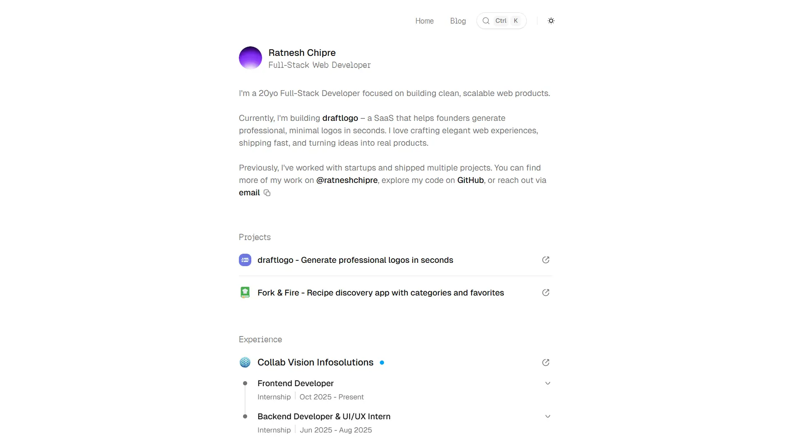

# [dev-roshan.com](https://dev-roshan.com)

A clean, professional showcase for my projects, work history, and personal blog as a Full Stack Developer.

→ Check out the live site: [dev-roshan.com](https://dev-roshan.com)

<a href="https://dev-roshan.com">
  <picture>
    <source media="(prefers-color-scheme: dark)" srcset="./public/images/screenshot-dark.webp">
    <source media="(prefers-color-scheme: light)" srcset="./public/images/screenshot-light.webp">
    
  </picture>
</a>

## Overview

### Stack

- Next.js 16
- TailwindCSS 4
- TypeScript
- shadcn/ui
- MDX

### Features

- Next.js 16 & TailwindCSS 4 – Cutting-edge architecture & Next-gen utility styling for peak performance.
- Command Menu (⌘K) – Global search and navigation palette.
- Full TypeScript – Type-safe codebase for robust development.
- MDX Integration – Markdown-powered blog with interactive components.
- Seamless Dark Mode – Fluid Light/Dark/System theme switching.
- GitHub Contribution Map – Live visualization of coding activity.
- Responsive shadcn/ui – Professional, accessible component library.
- Optimized Images – Fast-loading media with medium-style zoom.
- Automated SEO – Smart metadata, sitemaps, and robots.txt.

## Star History

<picture>
  <source media="(prefers-color-scheme: dark)" srcset="https://repostars.dev/api/embed?repo=roshnn-sahu%2Fdev-roshan.com&theme=dark">
  <source media="(prefers-color-scheme: light)" srcset="https://repostars.dev/api/embed?repo=roshnn-sahu%2Fdev-roshan.com&theme=light">
  
</picture>

## License

This project is licensed under the [MIT license](./LICENSE).
